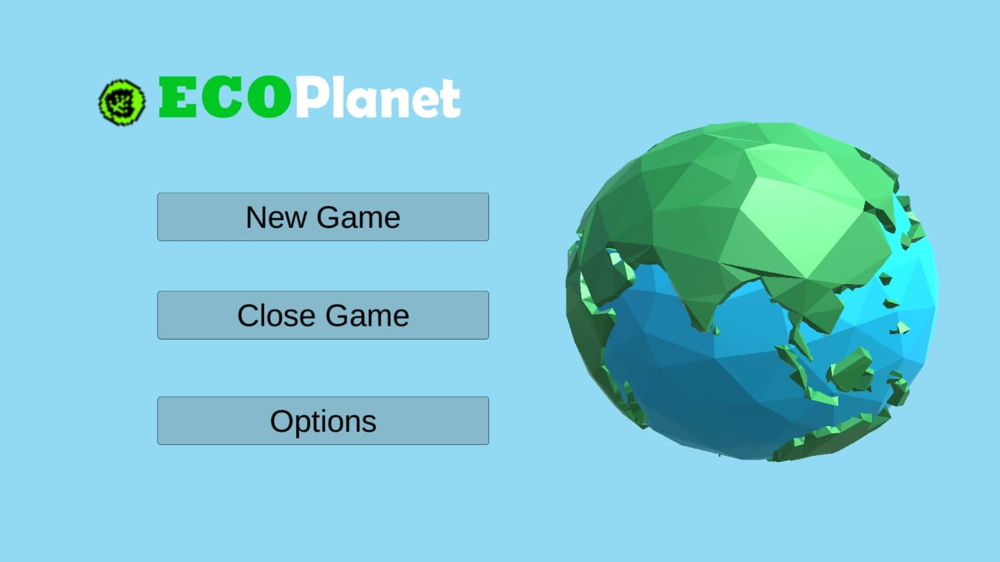

# ECO-Planet

## What is this project about?

NASA has challenged people around the world to take a step toward helping the develop of new and innovative technologies, tools and approaches to today's problems, but in only 72 hours. So thinking of that our group chose to develop a video-game to help, mostly kids, to have a fun and interactive relationship with science and Earth's Data, rasing awareness around the United Nations' 2030 agenda for Human development . 

## Tools used for this project

It was used the UNITY IDE for the codding as well as PhotoShop and Piskel for the aesthetic.

### Programming Languages

The c\# was used, basicly because its one of the unity's most acknowledged laguage and the one with more avaliable online material

## Game Overview

this video-game is a turn based resources managment simulator. In whitch the player has to administrate the world, encourage science research in many fields and everyone is conected

## Images

